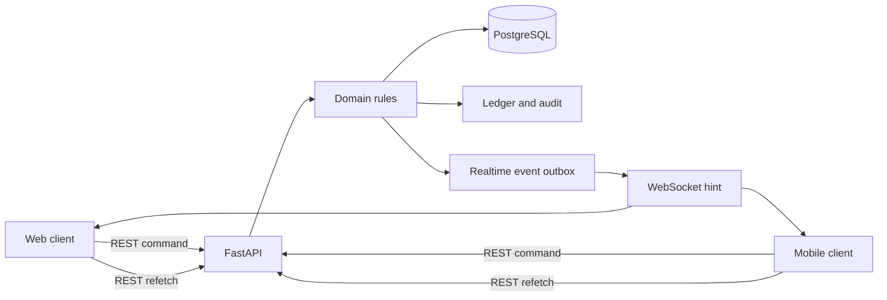

# Multiplayer Architecture Report

Status: implemented and locally validated on 2026-07-19.

## Scope and boundary

The multiplayer layer extends the existing server-authoritative seasonal world with shared cities, markets, rival operations, cartel territory, phased wars, alliances, moderated communications, and realtime invalidation hints. The repository safety contract remains authoritative: Vesper and all districts, organizations, people, and operations are fictional and abstract.

## Authority model

PostgreSQL is the canonical production store. Clients never calculate final costs, success, rewards, control changes, war scores, or market settlement. Every mutation is authenticated, scoped to the active world/profile, validated against permissions and protection, recorded in the database, and returned as an authoritative representation.

WebSocket messages are deliberately hints, not state replication. They contain an event type and identifiers; web/mobile then refetch the relevant REST resource.

## Persistent model

- World layer: `cities`, `city_markets`, city-scoped districts and profiles.
- PvP: operations, participants, defense actions, perspective reports, cooldowns, protection states, reputation.
- Cartel war: wars, participants, objectives, operations, weighted scores, events, ceasefire treaties.
- Territory: claims, six abstract control-point types per district, contributions, immutable history.
- Alliances: alliances, cartel memberships, roles, alliance treaties.
- Communication: direct messages, scoped channels, memberships, messages, blocks, moderation reports.
- Economy and observability: offers, trades, realtime event outbox, anti-cheat risk events.

Migration `0002_multiplayer_core` supports both an existing 0001 production schema and a fresh installation. SQLite receives application validation and indexes where it cannot add a foreign key to an existing table; PostgreSQL receives the foreign keys. A fresh SQLite upgrade → downgrade → upgrade was executed successfully.

## Domain boundaries

- `multiplayer_domain.py`: PvP, protection, reputation, territory, war phases and scoring.
- `multiplayer_social.py`: alliances, channels, direct messages, blocking, moderation and market settlement.
- `multiplayer_api.py`: transport-only request validation, authentication dependencies, response projections, and critical reauthentication.
- `main.py`: authenticated realtime event polling and delivery.

The core worker calls `resolve_due_pvp` and `advance_due_wars` from the existing due-work loop. Resolution is deterministic for a given operation ID and secret seed, so retries cannot reroll an outcome.

## Concurrency and idempotency

- Profile and organization balances use ledger entries with scoped uniqueness.
- PvP creation is unique by attacker and idempotency key.
- Territory contributions and war operations are idempotent per profile/key.
- Market offers are unique per seller/key; one trade is allowed per offer.
- PostgreSQL row locks protect operation, war, claim, offer, balance, and score mutations.
- Unique conflicts are normalized to HTTP 409 and roll back the complete transaction.

The integration suite includes a real two-request race on one market offer. Exactly one buyer settles; the losing transaction is rejected and no double ledger/resource mutation remains.

## Client surfaces

Web routes: `/pvp`, `/territories`, `/wars`, `/alliances`, `/communications`, and `/market`. Mobile exposes the same core state/actions in the Multiplayer tab. Shared TypeScript types and generated OpenAPI declarations are used across clients. German and English labels cover every new navigation and action.

## Validation evidence

- Backend: 24 passed.
- Load floor: 3 passed, including 1,000 parallel deterministic resolution inputs.
- Python formatting, Ruff, and strict mypy: passed.
- Web shared types, i18n, web typecheck/lint: passed.
- Mobile typecheck/lint: passed.

