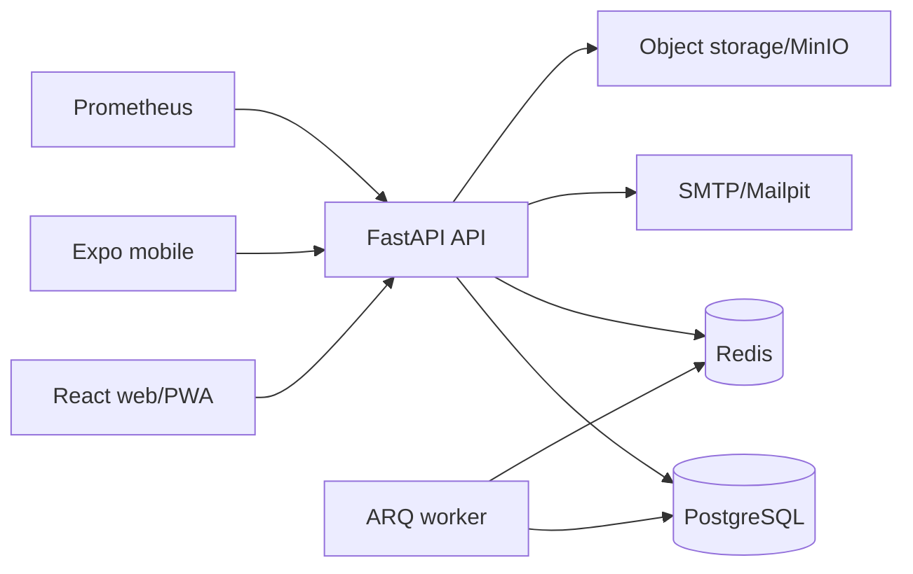

# Architecture

SHADOWGRID is a server-authoritative seasonal strategy game. Clients submit intent; the API validates identity, world membership, permissions, resource constraints and idempotency before changing state.

The monorepo separates deployable applications (`apps/api`, `apps/worker`, `apps/web`, `apps/mobile`) from shared contracts and configuration (`packages/*`). FastAPI produces the canonical OpenAPI document; `openapi-typescript` generates the client contract. English is the canonical message catalogue, German is human-reviewed, and all other configured locales fall back to English until reviewed translations are supplied.

## Data and consistency

- PostgreSQL is authoritative in production; SQLite is only the zero-dependency local/test path.
- Every economic mutation writes an append-only ledger entry and updates the locked balance in the same transaction.
- `Idempotency-Key` records prevent duplicated purchases, operations, research and treasury mutations.
- Refresh tokens are opaque, hashed with a server pepper, rotated on use and revoked as a family on replay.
- The worker resolves due operations/research, hourly business settlement and queued mail. Jobs use deterministic settlement/idempotency keys.
- Datetimes are stored and returned as UTC. API envelopes contain server time and request IDs.

## Game boundaries

The launch slice includes eight districts, four starter archetypes, five businesses, six facilities, eight specialist roles, five abstract operation categories and twelve world-event types. All places, organizations and actions are fictional; no operation exposes procedural real-world wrongdoing.

## Decision record

Architecture and scope decisions made during implementation are recorded in [decisions.md](../.project/decisions.md). The release uses a modular monolith because transactional game invariants are more valuable at this stage than distributed-service complexity. API, worker and clients are independently deployable without splitting the authoritative database transaction boundary.
