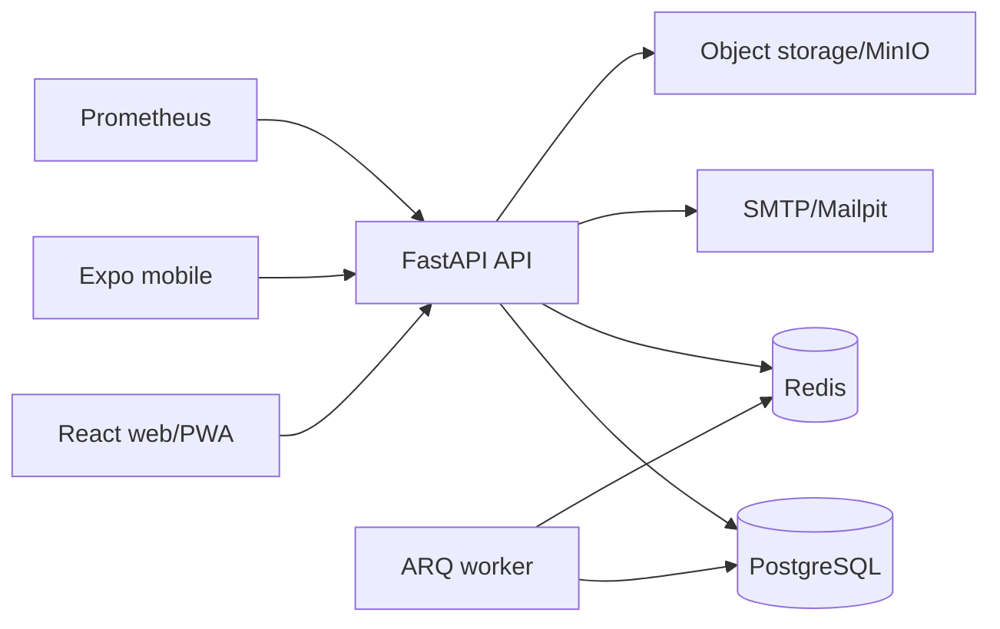

# SHADOWGRID Architecture

SHADOWGRID is a server-authoritative seasonal strategy game. Clients submit intent; the API validates identity, world membership, permissions, resource constraints and idempotency before changing state.

This document is the canonical technical source of truth required by `AGENTS.md`.
The product roadmap predates the existing implementation and names Flask, Celery and
Socket.IO. SHADOWGRID already has a tested FastAPI, ARQ and durable-event implementation.
Replacing that stack would invalidate migrations, API contracts and production evidence
without changing the required modular-monolith boundaries. The project therefore retains
FastAPI and ARQ while implementing the roadmap's domain behavior and REST contracts on the
existing transaction boundary. Realtime delivery remains a replaceable adapter; REST and
the database are authoritative.

The monorepo separates deployable applications (`apps/api`, `apps/worker`, `apps/web`, `apps/mobile`) from shared contracts and configuration (`packages/*`). FastAPI produces the canonical OpenAPI document; `openapi-typescript` generates the client contract. English is the canonical message catalogue. The 36 BCP 47 launch packages, context records, glossaries and review evidence live in `packages/i18n/locales`. Runtime fallback is disabled. A locale can enter a public bundle only after its catalogue is complete and its independent native, in-game, accessibility, screenshot, store, support and legal approvals pass `pnpm i18n:release`.

## Data and consistency

- PostgreSQL is authoritative in production; SQLite is only the zero-dependency local/test path.
- Cash uses integer-cent accounts and balanced transaction headers/entries. Each transfer
  locks accounts in stable order, writes equal source and target entries, updates balances
  and verifies a zero transaction sum before commit.
- The legacy resource ledger remains a compatibility read model and is synchronized with
  the player cash account inside the same transaction.
- `Idempotency-Key` records prevent duplicated purchases, operations, research, cartel
  governance, treasury and project-contribution mutations.
- Refresh tokens are opaque, hashed with a server pepper, rotated on use and revoked as a family on replay.
- The worker resolves due operations/research, legacy business settlement, authoritative
  hourly company-economy ticks, specialist payroll, deterministic local-AI decisions,
  daily specialist-market refresh, due exchange-order expiry and queued mail. Economy, payroll and AI periods are
  unique per world/UTC hour. Market allocation, company state, financial settlement and
  immutable reports use explicit transaction boundaries and idempotent commands.
- Datetimes are stored and returned as UTC. API envelopes contain server time and request IDs.

## Game boundaries

Season 0 begins in Cologne with five strategic districts. Private companies in gastronomy,
logistics and technology have dedicated accounts, 10,000-basis-point ownership and
data-driven investments. Phase 3 adds deterministic city-sector demand, weighted
capacity-constrained allocation, revenue/cost/profit settlement, enterprise-value version 1
and auditable time-series reports. Phase 4 adds deterministic specialist markets, employment,
balanced payroll, capped company effects and local competitors whose rule-based actions use
the same company services as players. Phase 5 adds fixed-supply common shares, issuer
offerings, reserved price-time matching, immutable trade/share ledgers, price snapshots and
snapshot-based dividends. Company, account, order and holding row locks keep each match in
the modular-monolith transaction boundary. Phase 6 retains the historical organization table
as the cartel aggregate and adds one-active-membership enforcement, transactional leadership,
balanced cartel accounts, two-person large-expense approval, immutable project contributions,
aggregate district influence and control-point projections. World locks plus stable resource
locks serialize cartel mutations across PostgreSQL workers; a process lock provides equivalent
local SQLite behavior. Phase 7 adds immutable intelligence snapshots, stored HMAC-derived
rolls, report offers that create immutable buyer copies, and expiring strategic effects.
Information and strategic costs are consumed before resolution inside the same transaction;
database rate windows and target cooldowns bound repeated actions. Active effects enter the
existing economy, cartel deadline, reputation and intelligence calculations as capped integer
modifiers. Phase 8 adds versioned event definitions and immutable concrete event instances.
Preview is read-only; activation, worker start, expiry and administrative end are idempotent,
audited lifecycle commands. Applicable active events compose in stable `(starts_at, id)`
order using integer basis-point arithmetic and hard bounds. Economy and payroll reports store
the effective event input snapshot. Activation and ending publish through the existing
durable realtime adapter while REST and the database remain authoritative. Later roadmap
phases add extended markets. Phase 9 introduces a versioned season template and a concrete
season aggregate with explicit UTC phase boundaries. Final category scores, tie metadata,
Hall-of-Fame entries, account rewards and seasonal archive rows are immutable. Closing
serializes on the world and season, snapshots all results before mutation, cancels exchange
reservations, archives seasonal aggregates and resets cash only through balanced system
transfers plus append-only resource ledger entries. No financial or audit history is
deleted. Strategic operations remain abstract and never expose procedural real-world
wrongdoing. Phase 10A adds tender, bid and commercial-contract aggregates. Awarding locks
the tender and both companies, derives the provider's reserved capacity from active
contracts and persists immutable commercial terms. Each due period is a unique immutable
settlement backed by a balanced company-account transfer. Insufficient issuer funds create
an abstract breach without overdrawing an account. Season close snapshots and cancels active
contracts and open tenders while retaining bids, settlements and financial history.
Phase 10B adds loan applications, accepted company loans and immutable payment records.
Underwriting snapshots all integer risk inputs; acceptance revalidates the lending limit
before a balanced system-to-company payout. Deterministic principal/interest components
sum exactly over the term. Due payments use unique period keys and balanced transfers;
insufficient cash produces an abstract default without overdraft. Active seasonal loans are
snapshotted and cancelled with the archived borrower while every financial row remains.
Phase 10C adds immutable bond-issue terms, subscriptions, aggregate holdings, an append-only
bond ownership ledger and per-holder settlements. Offering proceeds remain reserved on the
issuer account until activation. Coupon and maturity jobs preflight the complete
multi-holder obligation and then settle every holder inside one database transaction;
insufficient funds produce only abstract default rows, never partial payout. Season close
redeems principal atomically where possible and preserves every financial/ownership record.
Phase 10D adds district property indices, immutable daily index snapshots, persistent
player-owned property, lease obligations and headquarters improvements. Index calculations
compose district, cartel and event inputs with bounded integer basis-point arithmetic.
Purchases, resales, rent and improvements cross only balanced account-ledger services.
Property, account and company rows are locked before monetary validation; idempotency
records and unique payment periods make API and worker retries safe. Season close snapshots
property state, cancels leases and removes company use before company archival while
preserving player ownership and all transfer, payment and improvement history.

## Realtime adapter

Phase 11 keeps the native FastAPI WebSocket adapter instead of introducing a second
Socket.IO framework into the modular monolith. The first protocol-v1 message authenticates
the access session and identifies the intended world. The server then derives the player's
profile, city and active cartel channels; no client-supplied room name is trusted. Durable
events carry an explicit audience, version, expiry and optional world-scoped deduplication
key. Database constraints and a shared payload validator protect the envelope at both
application and persistence boundaries.

WebSocket delivery is an invalidation path, not a state store. The React client persists
only the last visible event ID per world, resumes in stable creation order after reconnect
and refetches authoritative REST queries. The REST event-feed endpoint uses the same
audience filter as the socket and rejects inaccessible cursors. Durable user notifications
have immutable content, an indexed unread projection and idempotent read commands.

## Release hardening

Phase 12 keeps protection state inside the modular monolith's shared transaction boundary.
Login and exchange-order rate windows are rows with hashed identities and atomic increments,
so restarts and multiple API workers cannot multiply a caller's allowance. HTTP receive
streams are counted independently of `Content-Length`, and WebSocket authentication input is
bounded before JSON parsing. Production and staging refuse wildcard, localhost, non-HTTPS
or structurally invalid CORS origins.

The database is also the release-evidence source. Seed version and deterministic random seed
are persisted, while a read-only verifier checks balanced ledger transactions, account
projections, non-negative/reserved balances, exact private-company ownership, fixed public
share supply, allocation bounds and SQLite foreign keys. The release load fixture invokes
the actual economy and exchange application services over 100 players, 500 companies and
10,000 open orders. Backup scripts verify content before restore, constrain sources to the
backup directory and create a local safety copy before atomic SQLite replacement; production
continues to use PostgreSQL custom-format dumps.

## Decision record

Architecture and scope decisions made during implementation are recorded in [decisions.md](../../.project/decisions.md). The release uses a modular monolith because transactional game invariants are more valuable at this stage than distributed-service complexity. API, worker and clients are independently deployable without splitting the authoritative database transaction boundary.
